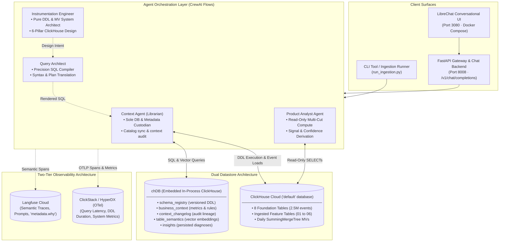
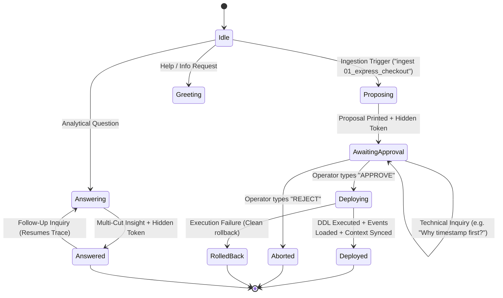
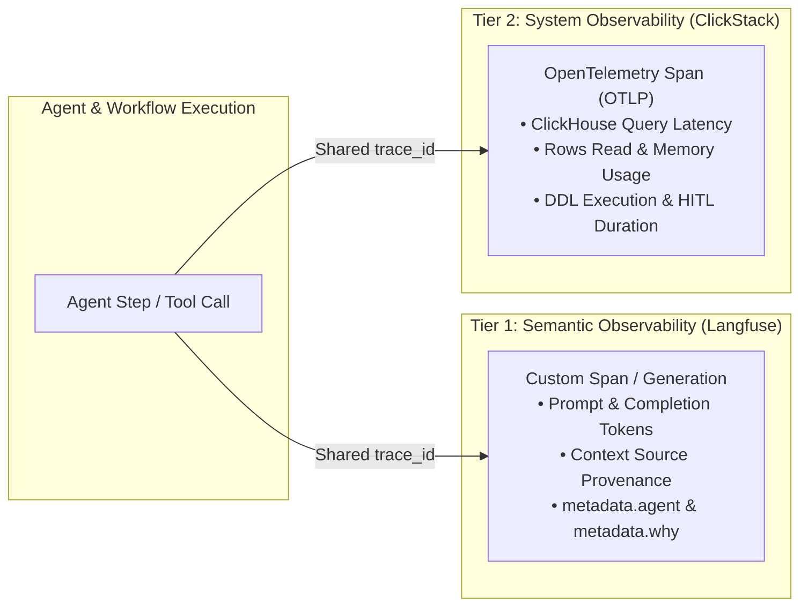

# InsightMesh Technical Architecture
### Click-a-thon 2026 — Deep Dive Technical Specification

This document provides a comprehensive technical breakdown of **InsightMesh**, an agentic data engineering and product analytics platform built for Atlys. It details the multi-agent orchestration model, deterministic execution pipelines, data custodianship boundaries, semantic context management in `chDB`, and end-to-end two-tier telemetry.

---

## 1. Architectural Principles & System Context

InsightMesh replaces the manual, fragmented lifecycle between product managers, data engineers, and data analysts with two deterministic Critical User Journeys (CUJs):
- **CUJ 1 — Schema Ingestion & Evolution**: Converts product specs (`spec.md`) and raw event streams (`events.ndjson`) into production ClickHouse DDL, materialized views, and updated semantic context behind a 2-turn Human-in-the-Loop (HITL) gate.
- **CUJ 2 — Telemetry Analytics & PM Diagnosis**: Translates natural-language business questions into multi-cut ClickHouse aggregations, validates against known system anomalies (K1–K7), derives causal concentrations, and produces actionable PM insights with calibrated confidence scores.

### 1.1 High-Level C4 Container Diagram



---

## 2. Agent Roster & Least-Privilege Custodianship Model

To eliminate context hallucination and prevent unvalidated schema modifications or ad-hoc query injections, InsightMesh implements a strict **Data Custodianship & Least-Privilege Separation of Concerns**:

| Agent Persona | Direct DB / Metadata Access? | Assigned Tools | Core Architectural Responsibilities |
| :--- | :---: | :--- | :--- |
| **`Context Agent`**<br>*(Context Librarian)* | ✅ **Sole Custodian**<br>(Read/Write `chDB` + ClickHouse DDL) | • `refresh_chdb_from_live`<br>• `build_context_package`<br>• `decide_strategy`<br>• `context_diff`<br>• `execute_ddl`<br>• `load_events`<br>• `register_schema_version`<br>• `sync_context`<br>• `write_table_semantics` | **Data Governance Gatekeeper & DB Custodian**: The only agent authorized to communicate with `chDB` and ClickHouse Cloud DDL. Briefs the Instrumentation Engineer with live catalog shapes, audits proposed DDL against business rules, manages HITL operator proposals, deploys approved tables/MVs, loads raw event batches, and writes versioned embeddings into `table_semantics`. |
| **`Instrumentation Engineer`**<br>*(Schema Architect)* | ❌ **Zero Direct Access** | • `design_schema` (LLM-driven)<br>• `infer_schema`<br>• `generate_mv`<br>• `explain_schema_rationale` | **Pure ClickHouse Systems Architect**: Operates as a pure design engine with zero database permissions. Analyzes raw event samples and feature specifications to design optimal 6-pillar ClickHouse schemas, determines event field mappings, justifies materialized views, and returns design intent to the Context Agent. |
| **`Query Architect`**<br>*(SQL Compiler)* | ❌ **Zero Direct Access** | • `design_to_ddl`<br>• `plan_queries` | **Precision SQL & DDL Translation Engine**: Shared between CUJ 1 and CUJ 2. Translates design intent into production ClickHouse DDL (`CREATE TABLE`, `CREATE MATERIALIZED VIEW`, `INSERT`) and converts analytical intent into typed `PlannedQuery` objects (5 cuts, intersection, time series, alt-denominator headline). Never makes autonomous design decisions and never executes queries. |
| **`Product Analyst Agent`**<br>*(Analytics Scientist)* | 🔍 **Read-Only Analytics**<br>(Strict `SELECT` Only) | • `analytics_compute`<br>• `score_confidence`<br>• `synthesize_insight` | **Analytics & Diagnostics Scientist**: Receives domain context and known issues (K1–K7) from the Context Agent. Pushes multi-cut aggregation queries into ClickHouse Cloud, performs result audits, calculates concentration ratios and date coincidences, computes calibrated confidence scores, and synthesizes executive PM reports. |

---

## 3. CUJ 1: Schema Ingestion & Evolution Pipeline

### 3.1 12-Phase Ingestion Workflow

```mermaid
sequenceDiagram
    autonumber
    actor Operator as Human Operator (LibreChat / CLI)
    participant CL as Context Agent (Sole DB Custodian)
    participant chDB as chDB (Local Metadata & Vectors)
    participant IE as Instrumentation Engineer (Pure Architect)
    participant QA as Query Architect (SQL Compiler)
    participant VAL as Invariant Validator
    participant CH as ClickHouse Cloud ('default')

    Note over Operator,CL: Phase 1: Ingestion Trigger
    Operator->>CL: 1. Ingest Feature Spec ("ingest 01_express_checkout")
    
    Note over CL,chDB: Phase 2 & 3: Catalog Refresh & Context Briefing
    CL->>CH: 2. Refresh live catalog (system.tables & system.columns)
    CL->>chDB: 3. Fetch schema_registry, business_context & metric definitions
    CL->>IE: 4. Handoff Context Briefing (existing tables, caveats, spec text, sample events)

    Note over IE,QA: Phase 5 & 6: Schema Design & SQL Compilation
    IE->>IE: 5. Formulate 6-Pillar Storage Design, Field Mapping & MV Justification
    IE->>QA: 6. Hand off Design Intent
    QA->>QA: 7. Render ClickHouse DDL, SummingMergeTree MV, and INSERT statement

    Note over QA,VAL: Phase 7: Invariant Safety Validation
    QA->>VAL: 8. Validate 4 Invariants (no id-first, partitioning, TTL, LowCardinality)
    VAL-->>CL: 9. Validation passed (0 violations; bounded 1-retry if failed)

    Note over CL,chDB: Phase 8 & 9: Semantic Audit & HITL Proposal
    CL->>chDB: 10. Run context_diff (detect denominator conflicts, caveats, gaps)
    CL-->>Operator: 11. Print Proposal Markdown + Hidden Token (<!-- atlys:proposal ... -->)

    Note over Operator,CL: Phase 10: Human-in-the-Loop Approval
    Operator->>CL: 12. "APPROVE" (explicit authorization)

    Note over CL,CH: Phase 11 & 12: Deployment, Load, Context Sync & Artifacts
    CL->>CH: 13a. Execute CREATE TABLE & CREATE MATERIALIZED VIEW
    CL->>CH: 13b. Load events.ndjson (FORMAT JSONEachRow)
    CL->>chDB: 13c. Register schema v+1, upsert business_context & context_changelog
    CL->>chDB: 13d. Write table_semantics (LLM summary + concepts + 768-dim embedding)
    CL-->>Operator: 14. Emit Receipt, Artifacts (schema.sql, run_report.md) & Langfuse Trace URL
```

### 3.2 ClickHouse 6-Pillar Storage Mechanics

The Instrumentation Engineer enforces six mandatory ClickHouse architectural rules:

1. **Ordering Key (`ORDER BY`)**:
   - Predicate-first ordering: Always leads with `(timestamp, user_id)` or `(timestamp, user_id, segment)`.
   - **Anti-Pattern Prohibited**: Never leads with event `id` or UUID. Leading with random UUIDs destroys ClickHouse sparse index granule pruning and severely degrades zstd compression.
2. **Partitioning (`PARTITION BY`)**:
   - Monthly partitioning via `toYYYYMM(timestamp)`.
   - Keeps total active parts bounded to 12 over a 1-year window, preventing the "too many parts" error caused by daily partitioning.
3. **Encoding & Types**:
   - `LowCardinality(String)` for bounded enums (`device_type`, `os`, `currency`, `geoip_country_code`).
   - `UInt8` for boolean flags (`otp_success`, `is_guest`).
   - `Nullable(...)` strictly for sparse event attributes.
4. **Data Retention (`TTL`)**:
   - Mandatory `TTL timestamp + INTERVAL 12 MONTH` to automate data lifecycle management and ensure compliance.
5. **Materialized Views (MV Justification)**:
   - Evaluates whether recurring multi-cut queries benefit from pre-aggregation.
   - Generates companion `SummingMergeTree` rollups partitioned by month and ordered by slice dimensions (`day, device_type, geoip_country_code`).
6. **Nested Object Flattening**:
   - Flattens nested JSON payloads into column primitives (e.g. `payment.amount` $\rightarrow$ `payment_amount`, `payment.latency_ms` $\rightarrow$ `payment_latency_ms`) to maximize columnar scan throughput.

### 3.3 Invariant Safety Validator

The validator guarantees non-negotiable storage invariants:
- **Rule 1**: Disallow `ORDER BY (id, ...)` or `ORDER BY (uuid, ...)`.
- **Rule 2**: Enforce presence of `PARTITION BY toYYYYMM(...)`.
- **Rule 3**: Enforce presence of `TTL ... + INTERVAL 12 MONTH`.
- **Rule 4**: Verify appropriate `LowCardinality` usage on categorical columns.
- **Bounded Self-Healing**: If any invariant fails, the validator sends structured feedback to the Instrumentation Engineer for a single redesign attempt. If a second attempt fails, a conservative template is applied and flagged in `run_report.md`.

---

## 4. CUJ 2: Telemetry Analytics & PM Diagnosis Pipeline

### 4.1 11-Phase Analytics Workflow

```mermaid
flowchart TD
    Q(["PM Natural-Language Question<br/>(via LibreChat UI / API)"]) --> GUARD["Guardrail Validation<br/>(Safety, Greeting, Scope Check)"]
    GUARD --> C1

    subgraph Phase1 ["Phase 1: 3-Guard Semantic Retrieval & Live Probe"]
        C1["1a. Vector Search over table_semantics<br/>cosineDistance(embedding, question_vec)<br/>Rank Top-3 Raw Table Candidates"]
        C2["1b. Load Context & Semantics<br/>Fetch column types, metrics, K1–K7 rules,<br/>context version, prior finding_key"]
        C3["1c. Live Aggregate Probe<br/>Row counts, date range, unique users,<br/>null shares (device_type, os)"]
        C1 --> C2 --> C3
    end

    subgraph Phase2 ["Phase 2: Resolution & Answerability Check"]
        ANS{"2+3. Answerability Contract<br/>(LLM Evaluates 3 Candidates)<br/>• Metric formula verified?<br/>• Post-purchase boundary trap?"}
    end

    subgraph Phase3 ["Phase 3: Query Planning & Invariant Check"]
        PLAN["5. Query Architect Planning<br/>• 5 Cuts: device, geo, destination, stage, guest<br/>• 1 Multi-cut intersection<br/>• 1 Time series (trend / date break)<br/>• 1 Alt-denominator headline"]
        VAL{"6. SELECT-Only & Column Invariant Check"}
        PLAN --> VAL
    end

    subgraph Phase4 ["Phase 4: Execution & Signal Derivation"]
        EXEC["7. ClickHouse Cloud Execution<br/>(Zero raw rows into LLM context)"]
        AUD["8. Result Audit (Empty cuts, null shares)"]
        DERIVE["9. Deterministic Signal Derivation<br/>• Concentration Ratio (delta_top / sum_delta)<br/>• Date Coincidence vs K-issue date<br/>• Trend State (new / persisting / reversed)<br/>• Calibrated Confidence Score"]
        EXEC --> AUD --> DERIVE
    end

    subgraph Phase5 ["Phase 5: Synthesis & Persistence"]
        SYN["10. PM Synthesis & Sufficiency Review<br/>Carries 'the why', recommends next step,<br/>highlights denominator conflicts"]
        OUT["11. Render LibreChat Markdown<br/>+ Persist chDB.insights (finding_key)<br/>+ Write insight_report.md & .json<br/>+ Attach Langfuse Trace URL"]
        SYN --> OUT
    end

    Q --> GUARD
    C3 --> ANS
    ANS -->|"Unanswerable Trap (e.g. Post-purchase SLA)"| DECLINE(["Honest Refusal Response<br/>Explains missing columns & boundary;<br/>Zero queries executed, zero hallucinated numbers"])
    ANS -->|"Answerable / Partial"| PLAN
    VAL -->|"Pass"| EXEC
    DERIVE --> SYN
```



### 4.2 3-Guard Semantic Vector Retrieval

To prevent hardcoded table-matching cascades that fail on unseen features, CUJ 2 executes native ClickHouse vector similarity against `chDB.table_semantics`:

```sql
SELECT 
    table_name, 
    spec_id, 
    description,
    cosineDistance(embedding, {question_embedding}) AS dist
FROM table_semantics
WHERE length(embedding) > 0
ORDER BY dist ASC
LIMIT 3;
```

**The Three Guards:**
1. **Distance Threshold ($\tau$)**: If the best candidate distance exceeds $\tau$, the system refrains from forcing a match and asks for clarification.
2. **Degraded Embedding Fallback**: If the embedding provider is unavailable, fallback passes the full schema catalog to the LLM.
3. **Unranked Candidate Inclusion**: If a table was just created without an embedding, it is retained as an unranked candidate rather than being made invisible.

### 4.3 Deterministic Signal Derivation & Confidence Scoring

Instead of relying on LLM intuition, all analytical signals are calculated deterministically:

1. **Concentration Ratio**:
   $$\text{Concentration} = \frac{\Delta_{\text{top\_segment}}}{\sum \Delta_{\text{all\_segments}}}$$
   - If $\ge 70\%$ of the conversion deficit is concentrated in a single segment (e.g. `device_type = 'ios'` in `country = 'AE'`), the anomaly is classified as an isolated segment regression rather than a systemic platform failure.
2. **Date Coincidence**:
   - Evaluates the inflection date in daily time-series data against the documented event timestamps in known issues (e.g. K1 release date `2026-03-11` vs drop date `2026-03-12`).
3. **Trend State (`finding_key`)**:
   - `finding_key = f"{table}::{metric}::{top_dimension}::{top_segment}"`
   - Enables exact string lookups against historical `chDB.insights` to classify findings as `NEW`, `PERSISTING`, or `REVERSED`.
4. **Calibrated Confidence Formula**:
   $$\text{Confidence} = f(N_{\text{sample}}, \Delta_{\text{effect}}, \text{Match}_{\text{K-Issue}}, \text{Consistency}_{\text{Cuts}}) \in [0.0, 1.0]$$

---

## 5. Semantic Layer & Vector Metadata Architecture (`chDB`)

InsightMesh embeds **chDB** (an in-process SQL engine powered by ClickHouse) to maintain five version-controlled metadata stores:

```
                  ┌────────────────────────────────────────────────────────────┐
                  │                 chDB Embedded Catalog                      │
                  ├─────────────────────────────┬──────────────────────────────┤
                  │  1. schema_registry         │  DDL Versions & Columns      │
                  │  2. business_context        │  Formulas, Caveats & K1-K7   │
                  │  3. context_changelog       │  Immutable Audit Trail       │
                  │  4. table_semantics         │  768-Dim Vector Embeddings   │
                  │  5. insights                │  Durable Diagnostic Memory   │
                  └─────────────────────────────┴──────────────────────────────┘
```

### 5.1 Metadata Schemas

```sql
-- 1. Schema Version Registry
CREATE TABLE schema_registry (
    table_name String,
    ddl String,
    columns_json String,
    spec_id String,
    version UInt16,
    created_at DateTime
) ENGINE = MergeTree ORDER BY (table_name, version);

-- 2. Business Context & Caveats
CREATE TABLE business_context (
    id String,
    section String,
    key String,
    definition String,
    version UInt16,
    valid_from DateTime,
    source String,
    status String
) ENGINE = MergeTree ORDER BY (section, key, version);

-- 3. Immutable Governance Changelog
CREATE TABLE context_changelog (
    timestamp DateTime,
    change_type String,
    entity_key String,
    before_value String,
    after_value String,
    agent String,
    trace_id String
) ENGINE = MergeTree ORDER BY (timestamp, entity_key);

-- 4. Vector Semantic Layer (CUJ 1 -> CUJ 2 Handoff)
CREATE TABLE table_semantics (
    table_name String,
    spec_id String,
    description String,
    concepts String,
    embedding Array(Float32),
    version UInt16,
    created_at DateTime
) ENGINE = MergeTree ORDER BY (table_name, version);

-- 5. Durable Diagnostic Insights
CREATE TABLE insights (
    spec_id String,
    question String,
    answer_md String,
    confidence Float32,
    cuts_json String,
    finding_key String,
    trace_id String,
    created_at DateTime
) ENGINE = MergeTree ORDER BY (spec_id, created_at);
```

---

## 6. Stateless Conversation State Machine

To support multi-turn Human-in-the-Loop workflows in LibreChat without complex server session management, InsightMesh reconstructs state dynamically from conversation history using hidden HTML tokens:



### Turn Token Serialization
- **CUJ 1 Proposal Token**:
  ```html
  <!-- atlys:proposal spec_id=01_express_checkout table=express_checkout trace=5b2b8bbc50f0fae0389ca50d0e1e9559 -->
  ```
- **CUJ 2 Insight Token**:
  ```html
  <!-- atlys:insight table=express_checkout metric=conversion_rate finding_key=express_checkout::conversion_rate::device_type::ios trace=ce7dce3da46846962595f3a26d4e3d5e -->
  ```

---

## 7. Observability & Telemetry Architecture

InsightMesh implements a unified two-tier observability model satisfying the *"no trace, no credit"* mandate:



### Span Contract Specification
Every Langfuse span recorded by InsightMesh adheres to a standardized schema:
- **`input`**: Serialized input arguments and upstream context.
- **`output`**: Result payload, DDL status, or computed metrics.
- **`metadata.agent`**: Assigned persona (`context_agent`, `instrumentation_agent`, `query_architect`, `analytics_agent`).
- **`metadata.why`**: A concise sentence justifying the architectural or analytical decision (e.g. *"led ordering key with (timestamp, user_id) because funnel queries filter by time range before user cohort"*).
- **`metadata.trace_url`**: Direct deep link to the Langfuse inspection dashboard.

---
*Authored for the Click-a-thon 2026 Submission by the InsightMesh Team.*
