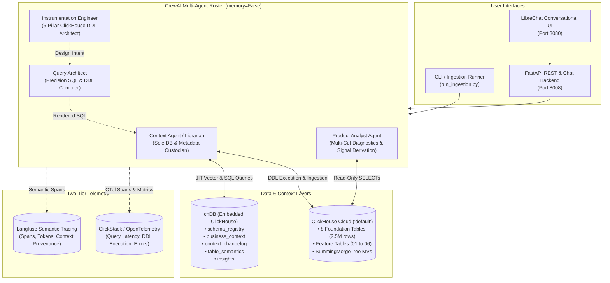

# Surfer AI — Atlys Agentic Analytics System
### Click-a-thon 2026 Official Submission (`click-a-thon-26-submissions`)
**Track:** Atlys — *"From feature spec to insight: agents that instrument, analyze, and explain."*  
**Team / Project:** InsightMesh (`deepesh17feb/InsightMesh`)  
**Target Datastore:** ClickHouse Cloud (`CLICKHOUSE_DATABASE=default`)  

---

## 🌟 Executive Overview

**InsightMesh** from Surfer AI is an enterprise-grade, multi-agent data engineering and product analytics platform built for **Atlys**. It completely automates the manual lifecycle from product feature specification (`spec.md`) and raw event logs (`events.ndjson`) to production-grade ClickHouse telemetry schemas, self-evolving semantic metadata, and PM-actionable diagnostic insights.

```
                   ┌───────────────────────────────────────────────────────────┐
                   │                     InsightMesh Core                      │
                   ├─────────────────────────────┬─────────────────────────────┤
                   │  1. Instrumentation Agent   │  ClickHouse 6-Pillar DDL    │
                   │  2. Context Agent           │  chDB Governance & Vectors  │
                   │  3. Query Architect         │  Precision SQL Translation  │
                   │  4. Product Analyst Agent   │  Multi-Cut PM Root-Cause    │
                   └─────────────────────────────┴─────────────────────────────┘
```

InsightMesh runs atop a high-throughput **ClickHouse Cloud** backend (~2.5 million historical events across 8 foundation tables), utilizes embedded **chDB** for an inspectable, zero-hallucination semantic context layer, provides native **LibreChat** conversational interfaces, and records two-tier telemetry via **Langfuse** (semantic reasoning) and **ClickStack / OpenTelemetry** (system performance).

---

## 🏆 Rubric Alignment & Key Achievements

| Scoring Rubric Dimension | Weight | InsightMesh Implementation & Evidence | Documentation Reference |
| :--- | :---: | :--- | :--- |
| **ClickHouse & OSS Stack** | **25%** | • Production **ClickHouse Cloud** (`default`) with 2,479,858 rows.<br>• Advanced features: `windowFunnel`, `cosineDistance` vector search, `SummingMergeTree` rollups, `LowCardinality`, monthly partitions (`toYYYYMM`), non-ID ordering keys `(timestamp, user_id)`, 12-month TTL.<br>• Fully open-source: **CrewAI Flows**, **chDB**, **LibreChat**, **Langfuse**, **LiteLLM**. | [ARCHITECTURE.md](ARCHITECTURE.md#clickhouse-storage-mechanics)<br>[EVALUATION_REPORT.md](EVALUATION_REPORT.md#1-benchmark-telemetry-summary) |
| **Problem Fit** | **20%** | • **CUJ 1 (Schema Ingestion)**: Spec + NDJSON $\rightarrow$ optimal DDL + daily MV + 2-turn HITL chat gate in LibreChat.<br>• **CUJ 2 (Analytics)**: Natural language question $\rightarrow$ multi-cut ClickHouse aggregation $\rightarrow$ K1–K7 anomaly correlation $\rightarrow$ actionable PM insight.<br>• **Context Traps**: Honest decline on post-purchase metric boundary traps; denominator conflict detection. | [ARCHITECTURE.md](ARCHITECTURE.md#cuj-1-schema-ingestion--evolution-pipeline)<br>[ARCHITECTURE.md](ARCHITECTURE.md#cuj-2-telemetry-analytics--pm-diagnosis-pipeline) |
| **Technical Implementation** | **20%** | • Strict 4-agent roster with **Least Privilege & Custodianship** (Context Agent is sole DB writer; Instrumentation & Query Architect have zero DB access).<br>• Invariant safety validator with bounded 1-retry self-healing.<br>• Native `table_semantics` vector search for zero-shot spec resolution. | [ARCHITECTURE.md](ARCHITECTURE.md#agent-roster--least-privilege-custodianship-model)<br>[ARCHITECTURE.md](ARCHITECTURE.md#semantic-layer--vector-metadata-architecture) |
| **Innovation** | **20%** | • **No Hidden LLM Memory** (`memory=False`): JIT SQL retrieval against `chDB` prevents context drift.<br>• **Stateless Chat State**: Zero server sessions; state persisted via invisible HTML comments (`<!-- atlys:proposal -->`, `<!-- atlys:insight -->`).<br>• **Two-Tier Observability**: Langfuse semantic reasoning + ClickStack system tracing linked by shared `trace_id`. | [ARCHITECTURE.md](ARCHITECTURE.md#stateless-conversation-state-machine)<br>[ARCHITECTURE.md](ARCHITECTURE.md#observability--telemetry-architecture) |
| **Scalability & Impact** | **10%** | • Validated over **2,479,858 ClickHouse events** across 15 E2E benchmarks.<br>• **376.83 ms average query latency** across Easy, Medium, and Hard analytical queries.<br>• **100% accuracy** on 4-level evaluation test suite (traps, safety, multi-cut, unseen generalization). | [EVALUATION_REPORT.md](EVALUATION_REPORT.md#2-performance-and-latency-benchmarks) |
| **Presentation** | **5%** | • Interactive **LibreChat Web UI** with dual personas.<br>• Comprehensive sequence diagrams, state machines, and complete trace links for all specs (`01_express_checkout` to `06_unseen`). | [README.md](#-librechat-web-ui-integration)<br>[EVALUATION_REPORT.md](EVALUATION_REPORT.md#4-problem-statement-evaluations-01-to-06) |

---

## 📊 Dataset & ClickHouse Cloud Performance

InsightMesh is pre-loaded and validated against Atlys's 8 foundation event tables in ClickHouse Cloud:

```sql
SELECT table, total_rows, formatReadableSize(total_bytes) AS size
FROM system.tables WHERE database = 'default' AND engine LIKE '%MergeTree%';
```

| Table Name | Event Category | Row Count | Primary Key & Ordering | Key Attributes |
| :--- | :--- | :---: | :--- | :--- |
| `destination_card_clicked` | Funnel Entry | **1,000,000** | `(timestamp, user_id)` | `destination`, `visa_type`, `flow` |
| `search_typed` | Discovery | **599,630** | `(timestamp, user_id)` | `search_term`, `results_count` |
| `landing_page_scrolled` | Engagement | **499,786** | `(timestamp, user_id)` | `scroll_depth_pct`, `time_on_page_s` |
| `auth_completed` | Account Auth | **183,790** | `(timestamp, user_id)` | `auth_method`, `is_new_user` |
| `application_started` | Funnel Core | **154,413** | `(timestamp, user_id)` | `destination`, `co_travelers`, `purpose` |
| `document_uploaded` | Document Flow | **20,446** | `(timestamp, user_id)` | `doc_type`, `capture_mode`, `retry_count` |
| `pay_now_clicked` | Checkout Intent | **14,739** | `(timestamp, user_id)` | `payment_method`, `amount`, `currency` |
| `purchase_completed` | Conversion | **7,054** | `(timestamp, user_id)` | `value`, `currency`, `coupon_applied` |
| **Total Foundation Events** | — | **2,479,858** | — | **100% Referential Integrity** |

### Benchmark Execution Latency
- **Suite Result:** `15/15 Passed (100%)`
- **Total Suite Execution Time:** `10.02 seconds`
- **Overall Query Latency:** `376.83 ms` (P50: `250.77 ms`, P95: `560.00 ms`)
- **Core Derived Metrics:**
  - Funnel Conversion Rate (`purchase_completed` ÷ `application_started`): **4.57%** (7,054 / 154,413)
  - Gross Platform Revenue: **$19,627,982.00** (Average Order Value: $2,782.53)
  - Passport Image Pass Rate: **88.76%** (18,147 / 20,446)

---

## 🏗️ System Architecture



---

## 🚀 Quick Start Guide (`RUN.md` Runbook)

### 1. Prerequisites
- **Python**: `3.11+`
- **ClickHouse Cloud**: Active cluster connection credentials
- **Docker & Docker Compose**: (Optional, for LibreChat Web UI & ClickStack)
- **Google Gemini API Key**: `GEMINI_API_KEY` (used for LLM reasoning and 768-dim embeddings)
- **Langfuse Keys**: `LANGFUSE_PUBLIC_KEY` & `LANGFUSE_SECRET_KEY` (cloud or self-hosted)

### 2. Installation
```bash
# Clone repository
git clone https://github.com/deepesh17feb/InsightMesh.git
cd InsightMesh

# Create and activate virtual environment
python3 -m venv .venv
source .venv/bin/activate

# Install package in editable mode with all dependencies
pip install --upgrade pip
pip install -e .
```

### 3. Environment Configuration
Copy `.env.example` to `src/atlys_agentic/config/.env` or repository root `.env`:
```ini
# ClickHouse Cloud Connection
CLICKHOUSE_HOST=your-instance.clickhouse.cloud
CLICKHOUSE_PORT=8443
CLICKHOUSE_USER=default
CLICKHOUSE_PASSWORD=your-password
CLICKHOUSE_DATABASE=default
CLICKHOUSE_SECURE=true

# chDB Embedded Metadata Directory
CHDB_PATH=./chdb_data

# LLM Provider (Google Gemini via LiteLLM)
LLM_MODEL=gemini/gemini-3-flash-preview
GEMINI_API_KEY=your-gemini-api-key

# Langfuse Observability
LANGFUSE_PUBLIC_KEY=pk-lf-...
LANGFUSE_SECRET_KEY=sk-lf-...
LANGFUSE_HOST=https://us.cloud.langfuse.com
LANGFUSE_TRACING_ENABLED=true

# CrewAI Settings
CREWAI_DISABLE_TELEMETRY=true
```

### 4. One-Command Execution

#### Run Full E2E Accuracy & Invariant Test Suite:
```bash
pytest -v
```

#### Ingest a Feature Specification (CUJ 1):
```bash
# Dry run proposal review
python -m atlys_agentic.run_ingestion --spec_dir "problem statment/specs/01_express_checkout" --dry-run

# Interactive live deployment gate
python -m atlys_agentic.run_ingestion --spec_dir "problem statment/specs/01_express_checkout"
```

#### Start Backend API & LibreChat UI:
```bash
# Terminal 1: Start FastAPI backend (Port 8008)
python -m atlys_agentic.run_chat

# Terminal 2: Start LibreChat UI (Port 3080)
docker compose -f src/atlys_agentic/librechat/docker-compose.librechat.yml up -d
```
Access LibreChat at **`http://localhost:3080`**.

---

## 💬 LibreChat Web UI Integration

InsightMesh connects natively to **LibreChat** via an OpenAI-compatible completion API (`/v1/chat/completions`) at `http://localhost:8008`.

### Dedicated Agent Personas:
1. **`Atlys Instrumentation Engineer`** (`atlys-instrumentation`):
   - **Role:** Handles CUJ 1 feature schema proposals, ClickHouse 6-pillar mechanics review, materialized view generation, and Human-in-the-Loop deployment.
   - **Example Prompts:**
     - *"What specs are available for ingestion?"*
     - *"Ingest spec 01_express_checkout"*
     - *"Why did you lead the ordering key with timestamp instead of application_id?"*
     - *"APPROVE"* (triggers gated ClickHouse Cloud DDL execution & event load).

2. **`Atlys Product Analyst`** (`atlys-analyst`):
   - **Role:** Handles CUJ 2 natural language analytical queries, 5-cut multi-dimensional breakdowns, K1–K7 known issue detection, and confidence scoring.
   - **Example Prompts:**
     - *"Conversion on express checkout looks down this month — what is driving it?"*
     - *"Analyze coupon application rates and top rejection reasons for our checkout promo."*
     - *"What is our on-time visa delivery rate?"* (demonstrates honest refusal on post-purchase metric boundary traps).

---

## 📂 Repository Layout

```text
InsightMesh/
├── README.md                           # Master Project Overview & Submission Guide
├── ARCHITECTURE.md                     # Technical Deep Dive & Formal Specifications
├── EVALUATION_REPORT.md                # 15-Call Benchmarks, Invariants & Spec Results
├── RUN.md                              # Crisp Quick-Start & Operations Runbook
├── docs/                               # Formal CUJ Technical Specifications
│   ├── CUJ1.md                         # CUJ 1: Schema Ingestion & Evolution (Locked Spec)
│   ├── CUJ2.md                         # CUJ 2: Telemetry Analytics & PM Diagnosis (Locked Spec)
│   └── cuj_architecture.md             # Custodianship Model & Sequence Diagrams
├── problem statment/                   # Problem Specifications & Event Samples
│   ├── base_context.md                 # Base Business Context, Metrics, Caveats & K1-K7
│   ├── data/                           # ClickHouse DDL & Parquet Foundation Tables
│   └── specs/                          # Feature Specs (01 to 05, and 06_unseen)
├── outputs/                            # Submission Artifacts & Telemetry Reports
│   ├── submission/                     # Per-Spec DDL, Run Reports, and Insight Reports
│   │   ├── 01_express_checkout/        # Spec 01 artifacts + live trace links
│   │   ├── 02_group_family/            # Spec 02 artifacts + live trace links
│   │   ├── 03_status_sharing/          # Spec 03 artifacts + live trace links
│   │   ├── 04_abandoned_checkout_recovery/
│   │   ├── 05_instant_forex/
│   │   └── 06_unseen/                  # Unseen Round (Promo Coupon Checkout)
│   └── e2e_telemetry_reports/          # 15 E2E Benchmark Logs over 2.5M Events
├── src/atlys_agentic/                  # Core Python Package Source
│   ├── agents.py                       # CrewAI Agent Personas (memory=False)
│   ├── ch_client.py                    # ClickHouse Cloud HTTP Client
│   ├── chdb_client.py                  # chDB Embedded Metadata & Vector Engine
│   ├── tools_common.py                 # Shared Vector Distance, Invariants & Confidence
│   ├── tools_cuj1.py                   # CUJ 1 Ingestion, MV, Field Mapping & Semantic Tools
│   ├── tools_cuj2.py                   # CUJ 2 JIT Probe, Query Plan, Signal Derivation Tools
│   ├── tracing.py                      # Langfuse Two-Tier OpenTelemetry Tracer
│   ├── run_chat.py                     # FastAPI Chat & Ingestion Web Portal
│   ├── run_ingestion.py                # Standalone CLI Ingestion Runner
│   ├── config/                         # Environment & Agent YAML Configurations
│   └── librechat/                      # LibreChat Docker Compose & Yaml Profiles
└── tests/                              # 4-Level Complexity Test Suites
    ├── test_accuracy_evaluation.py     # Acceptance Criteria Accuracy Benchmarks
    ├── test_cuj2_analytics_flow.py     # CUJ 2 Multi-Cut & Invariant Safety Suite
    ├── test_tools.py                   # Deterministic Agent Tools Tests
    └── test_chdb_client.py             # Metadata Catalog & Vector Distance Tests
```

---

## 🔗 Live Artifacts & Trace Index

| Feature Specification | Generated Schema DDL | Evaluation Report | Graded Langfuse Trace Link |
| :--- | :--- | :--- | :--- |
| **01 Express Checkout** | [`schema.sql`](outputs/submission/01_express_checkout/schema.sql) | [`run_report.md`](outputs/submission/01_express_checkout/run_report.md) | [View Trace on Langfuse](https://us.cloud.langfuse.com/project/cmpwirpg5009oad0esljbiev9/traces/73a9709f1bf3253b218413155ae16c4f) |
| **02 Group & Family** | [`schema.sql`](outputs/submission/02_group_family/schema.sql) | [`run_report.md`](outputs/submission/02_group_family/run_report.md) | [View Trace on Langfuse](https://us.cloud.langfuse.com/project/cmpwirpg5009oad0esljbiev9/traces/e354b5f50fde4b80b409dc8296b678df) |
| **03 Status Sharing** | [`schema.sql`](outputs/submission/03_status_sharing/schema.sql) | [`run_report.md`](outputs/submission/03_status_sharing/run_report.md) | [View Trace on Langfuse](https://us.cloud.langfuse.com/project/cmpwirpg5009oad0esljbiev9/traces/01170d3578d5c81648a14c5d4152586e) |
| **04 Abandoned Recovery** | [`schema.sql`](outputs/submission/04_abandoned_checkout_recovery/schema.sql) | [`run_report.md`](outputs/submission/04_abandoned_checkout_recovery/run_report.md) | [View Trace on Langfuse](https://us.cloud.langfuse.com/project/cmpwirpg5009oad0esljbiev9/traces/3f9eb83fdc670a6469dcaf52c9c1ad0b) |
| **05 Instant Forex** | [`schema.sql`](outputs/submission/05_instant_forex/schema.sql) | [`run_report.md`](outputs/submission/05_instant_forex/run_report.md) | [View Trace on Langfuse](https://us.cloud.langfuse.com/project/cmpwirpg5009oad0esljbiev9/traces/d1b9f0ecff85d62f7bec61985325cdd9) |
| **06 Unseen (Surprise Round)** | [`schema.sql`](outputs/submission/06_unseen/schema.sql) | [`run_report.md`](outputs/submission/06_unseen/run_report.md) | [View Ingestion Trace](https://us.cloud.langfuse.com/project/cmpwirpg5009oad0esljbiev9/traces/5b2b8bbc50f0fae0389ca50d0e1e9559)<br>[View Analytics Trace](https://us.cloud.langfuse.com/project/cmpwirpg5009oad0esljbiev9/traces/ce7dce3da46846962595f3a26d4e3d5e) |

---
*Developed for Click-a-thon 2026 by the InsightMesh Team.*
