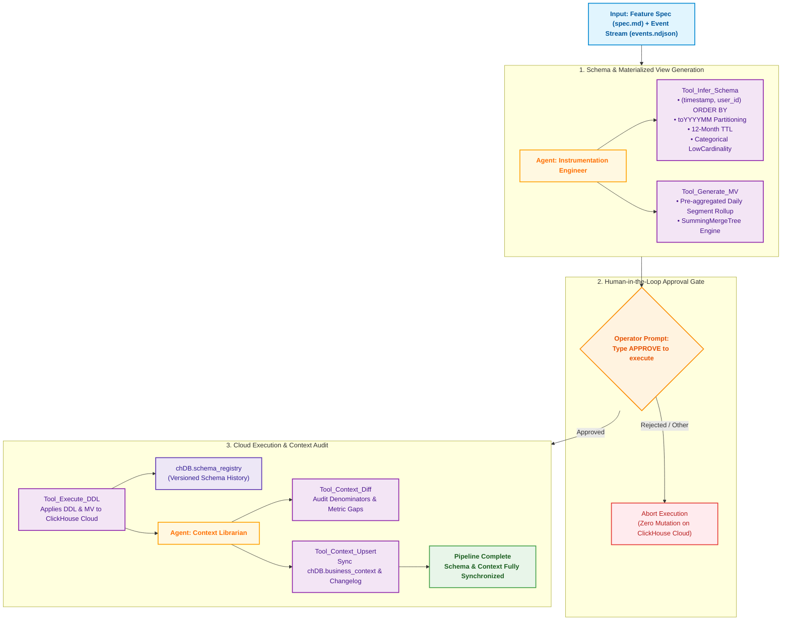
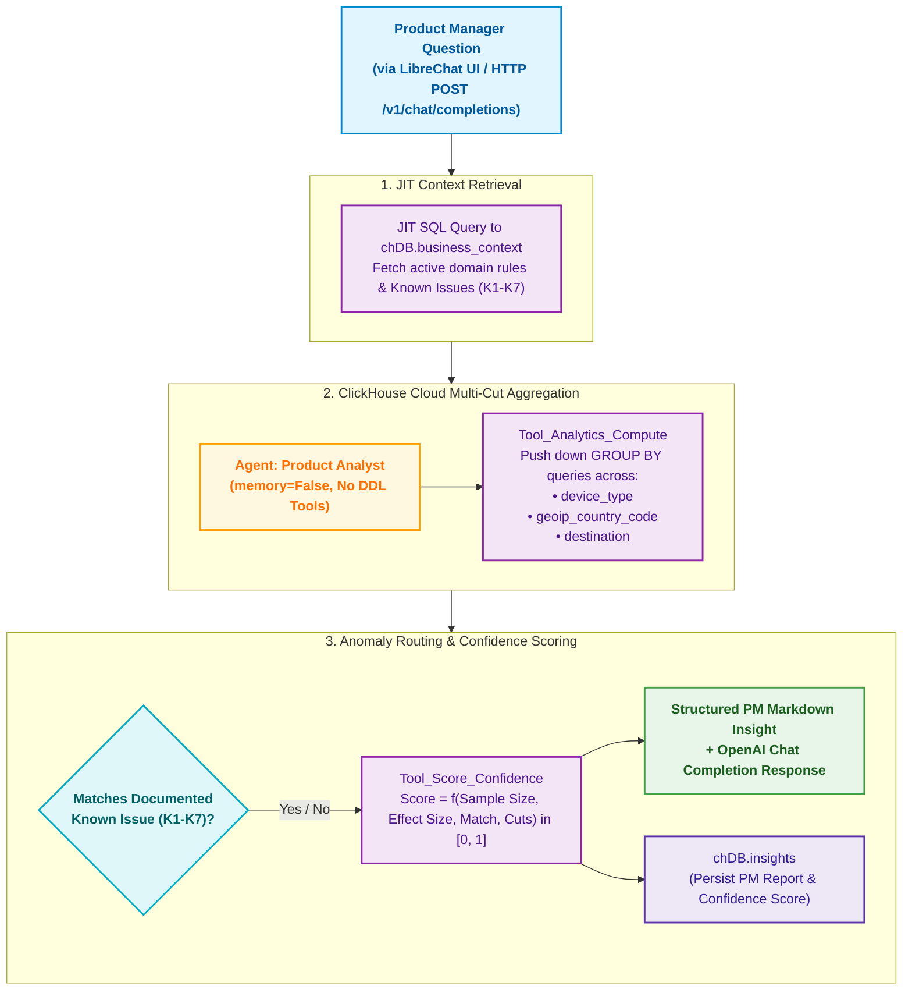

# Critical User Journeys (CUJ) & Architecture

This document details the two Critical User Journeys implemented in the Atlys Agentic Analytics System:

- **CUJ 1**: Automated Feature Ingestion & Context Audit Pipeline
- **CUJ 2**: Analyst Query & Anomaly Detection Interface

---

## CUJ 1: Feature Ingestion & Context Audit Pipeline

### Purpose
Automates the transition from a product feature specification (`spec.md`) and raw event data (`events.ndjson`) to production ClickHouse tables and materialized views, with an interactive Human-in-the-Loop approval gate and automatic `chDB` context synchronization.

### Workflow Diagram

### Steps Breakdown

1. **Schema Inference (`Instrumentation Engineer`)**:
   - **`Tool_Infer_Schema`**: Analyzes the NDJSON events stream and feature Markdown spec. Generates production ClickHouse DDL adhering to strict engineering constraints:
     - `ORDER BY (timestamp, user_id)` (never leads with UUID).
     - Monthly partitioning via `toYYYYMM(timestamp)`.
     - 12-month data retention TTL via `TTL timestamp + INTERVAL 12 MONTH`.
     - Flattens nested JSON objects (e.g. `payment.amount` $\rightarrow$ `payment_amount`).
     - Uses `LowCardinality(String)` for low-cardinality categorical attributes (e.g. `device_type`, `currency`).
   - **`Tool_Generate_MV`**: Inspects inferred columns for slice/segment dimensions (`device_type`, `geoip_country_code`, `destination`) and generates a companion daily pre-aggregation `SummingMergeTree` Materialized View.

2. **Human-in-the-Loop (HITL) Gate**:
   - Presents the proposed DDL and Materialized View to the operator.
   - Requires explicit literal input `"APPROVE"` to proceed. Any other input aborts immediately without touching ClickHouse Cloud.

3. **Execution & Context Audit (`Context Librarian`)**:
   - **`Tool_Execute_DDL`**: Executes DDL on ClickHouse Cloud and records versioned schema snapshot in `chDB.schema_registry`.
   - **`Tool_Context_Diff`**: Compares new table columns against `chDB.business_context`. Detects metric denominator contradictions and flags undocumented columns.
   - **`Tool_Context_Upsert`**: Upserts new metrics and column definitions into `chDB.business_context` with incremental versioning and appends audit trails to `chDB.context_changelog`.

---

## CUJ 2: Analyst Query & Anomaly Detection Interface

### Purpose
Provides product managers with an intuitive, hallucination-free conversational interface (via LibreChat UI or HTTP API). All analytical computations are executed natively in ClickHouse Cloud, and domain anomalies (K1–K7) are checked against a versioned business context layer.

### Workflow Diagram

### Steps Breakdown

1. **Just-In-Time (JIT) Context Retrieval**:
   - Queries `chDB.business_context` using SQL (`SELECT key, definition FROM business_context WHERE ...`).
   - Retrieves active metric formulas and documented anomalies (`K1`–`K7`).
   - Eliminates hidden LLM memory drift (`memory=False`).

2. **Mandatory Multi-Cut ClickHouse Aggregation**:
   - The **Product Analyst** agent has read-only access (`SELECT` only). Non-select operations are strictly blocked.
   - Pushes down dimension aggregation queries directly to ClickHouse Cloud across mandatory cut dimensions:
     - `device_type`
     - `geoip_country_code`
     - `destination`

3. **Anomaly Routing & Confidence Scoring**:
   - **Routing**: Evaluates question keywords and dimension aggregations against retrieved context definitions (e.g. matching `K1: iOS WebKit OTP autofill regression`).
   - **`Tool_Score_Confidence`**: Calculates a deterministic confidence score:
     $$ \text{Score} = f(\text{Sample Size } N, \text{Effect Size } \Delta, \text{Known Issue Match}, \text{Cut Consistency}) \in [0, 1] $$
   - **Synthesis**: Formats a structured PM report, persists the insight to `chDB.insights`, logs the Langfuse trace span, and returns an OpenAI-compatible JSON payload to LibreChat.
