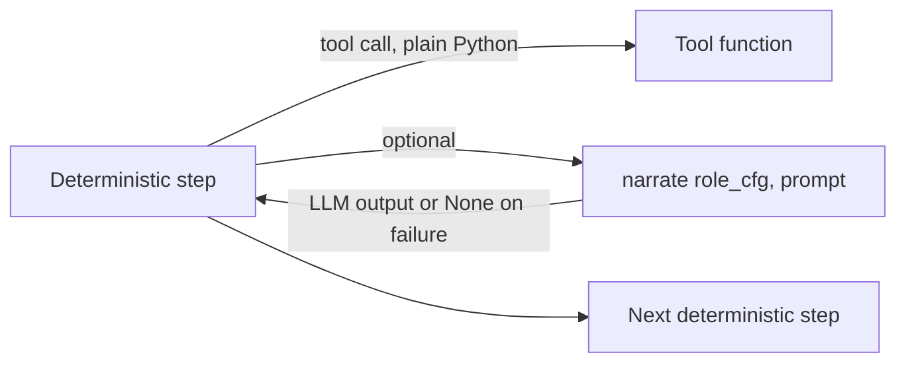

# Critical User Journeys (CUJ) v2 — Deterministic Workflow Architecture

> Supersedes `docs/cuj_architecture.md` for orchestration mechanics. Persona
> definitions and the least-privilege tool matrix are unchanged and still
> correct; what changes here is naming the architecture what it actually
> is (a deterministic pipeline with LLM narration calls), splitting two
> tools that mixed two responsibilities, and dropping the CrewAI
> `Agent`/`Flow` ceremony that the runtime never exercised — see the
> architecture review for the full finding set. This doc is the target
> for the Option B refactor; it describes intended structure, not yet the
> code as it stands on `feat/crewai-agents`.

- **CUJ 1**: Automated Feature Ingestion & Context Audit Pipeline (Human-in-the-Loop Gated)
- **CUJ 2**: Analyst Query & Anomaly Detection Interface (Read-Only Multi-Cut Analytics)

---

## 1. Orchestration model: deterministic pipeline, not agentic loop

Both journeys are a fixed sequence of Python function calls. Each step may
call zero or one narration LLM request to produce PM-readable prose, but
**no step ever lets an LLM decide which tool to call or in what order** —
tool selection and sequencing are hardcoded. This is the correct shape for
a system where one path (CUJ 1) mutates production ClickHouse Cloud schema:
determinism and auditability outrank agent autonomy here.

Personas (`instrumentation_engineer`, `context_librarian`, `product_analyst`)
are **role configs** — a dict of `role` / `goal` / `backstory` used only to
seed the system prompt of a narration call. They are not `crewai.Agent`
instances running a tool-calling loop, and no step is gated behind a
`crewai.Crew(...).kickoff()`. If a future step genuinely needs an LLM to
choose between multiple tools dynamically, promote *that step* to a real
CrewAI `Task`/`Crew` — don't promote the whole pipeline for one step's sake.



`narrate()` is the single owner of every LLM narration call (model choice,
API key resolution, Langfuse span, failure handling). A failed narration
call returns `None` and writes a `*_failed` trace span — callers fall back
to templated text, and that fallback is now visible in Langfuse instead of
indistinguishable from a healthy run.

---

## 2. Core Agent Personas, Data Custodianship & Tool Single-Responsibility

Same least-privilege boundary as v1, with two tools split so each does
exactly one thing — see § Tool SRP fixes below.

| Persona | DB / Metadata Access | Tools (post-split) | Role |
| :--- | :---: | :--- | :--- |
| **`Context Librarian`** | ✅ Sole DB & Metadata Custodian | `consult_internal_tables`<br>`context_diff`<br>`execute_ddl`<br>`register_schema_version`<br>`context_upsert`<br>`append_context_changelog` | Data governance gatekeeper. Briefs the Engineer, audits proposals, executes on approval, keeps the changelog. |
| **`Instrumentation Engineer`** | ❌ Zero Direct DB Access | `infer_schema`<br>`generate_mv`<br>`explain_schema_rationale` | Pure design/reasoning. Computes DDL/MV, hands the proposal back to the Librarian. |
| **`Product Analyst`** (CUJ 2) | 🔍 Read-Only Analytics | `analytics_compute` (SELECT-only, all paths)<br>`score_confidence` | Executes exactly the SQL the Query Architect hands it, scores confidence. Does not write SQL. |
| **`Query Architect`** (CUJ 2) | ❌ Zero Direct DB Access | `text_to_sql` | Pure text-to-SQL translation. Turns the PM question into SELECT statements — one per mandatory cut dimension, plus an optional question-targeted extra. Never executes, never scores, never writes. |

### Tool SRP fixes

Two v1 tools each mixed two responsibilities behind one call. Split so a
partial failure is attributable to the responsibility that actually failed,
instead of a single opaque tool result covering two unrelated writes:

- **`Tool_Execute_DDL`** (execute on ClickHouse Cloud + rollback) is now
  paired with a separate **`Tool_Register_Schema_Version`** (mirror the
  executed DDL into `chDB.schema_registry` with incremented version). The
  caller (Context Librarian step) calls both in sequence and can report
  "DDL executed, registry write failed" distinctly from "DDL itself failed."
- **`Tool_Context_Upsert`** (write `business_context` row) is now paired
  with a separate **`Tool_Append_Context_Changelog`** (append the audit
  trail row). Same rationale: a changelog-append failure should never be
  reported as a business-context write failure or vice versa.

Both new tools are still exclusively bound to the Context Librarian —
the split changes internal responsibility boundaries, not the
custodianship boundary between personas.

---

## 3. CUJ 1: Feature Ingestion & Context Audit Pipeline

### Purpose
Automates the transition from a product feature specification (`spec.md`)
and raw event data (`events.ndjson`) to production ClickHouse tables and
materialized views, with an interactive Human-in-the-Loop approval gate
and automatic `chDB` context synchronization.

### Workflow — deterministic pipeline, single entrypoint

```mermaid
sequenceDiagram
    autonumber
    actor Operator as Human Operator / LibreChat
    participant Pipeline as ingestion_flow.run() — deterministic, no kickoff()
    participant chDB as chDB (schema_registry & business_context)
    participant CH as ClickHouse Cloud

    Operator->>Pipeline: 1. Ingestion Request / Feature Spec Trigger
    Note over Pipeline,chDB: Phase 1: Context Briefing (plain function call)
    Pipeline->>chDB: 2. consult_internal_tables
    chDB-->>Pipeline: Existing tables, schema versions, metric definitions
    Pipeline->>Pipeline: 3. narrate(context_librarian_cfg, briefing_prompt) — optional prose

    Note over Pipeline: Phase 2: Schema & MV Design (plain function calls)
    Pipeline->>Pipeline: 4. infer_schema, generate_mv, explain_schema_rationale
    Pipeline->>Pipeline: 5. narrate(instrumentation_engineer_cfg, design_prompt) — optional prose

    Note over Pipeline,chDB: Phase 3: Semantic Audit
    Pipeline->>chDB: 6. context_diff
    Pipeline->>Pipeline: 7. narrate(context_librarian_cfg, audit_prompt) — optional prose
    Pipeline-->>Operator: 8. Presents Complete Proposal (Rationale + DDL + Context Diff)

    Note over Operator,Pipeline: Phase 4: Human-in-the-Loop Gate — hard stop
    Operator->>Pipeline: 9. Literal input "APPROVE" required; anything else aborts

    Note over Pipeline,CH: Phase 5: Execution & Sync (only on literal APPROVE)
    Pipeline->>CH: 10a. execute_ddl
    Pipeline->>chDB: 10b. register_schema_version
    Pipeline->>chDB: 10c. context_upsert + append_context_changelog
    Pipeline-->>Operator: 11. Deployment Receipt & Versioned Audit Snapshot
```

Every arrow above is a plain function call inside one `run()` — there is no
event bus, no `@listen`/`@router` dispatch, no `Crew.kickoff()`. State is a
single Pydantic `IngestionState` object threaded through the call chain,
not a framework-managed flow state.

### Steps Breakdown

1. **Context Briefing** — `consult_internal_tables` reads `chDB.schema_registry`
   / `business_context`. Result feeds an optional narration call; the pipeline
   proceeds identically whether or not narration succeeds.
2. **Schema & MV Design** — `infer_schema` (ORDER BY leads with
   `(timestamp, user_id)`, monthly `toYYYYMM(timestamp)` partitioning,
   12-month TTL, flattened nested JSON, `LowCardinality(String)` for
   categoricals), `generate_mv` (`SummingMergeTree` daily rollup when
   justified), `explain_schema_rationale` (6-pillar deep dive).
3. **Semantic Audit** — `context_diff` compares new columns against
   `business_context`; flags denominator conflicts, data-quality caveats,
   anti-patterns (`id`-first ordering), post-purchase metric boundaries,
   undocumented columns.
4. **Human-in-the-Loop Gate** — presents DDL, MV, rationale, diff. Requires
   the exact literal `"APPROVE"`. Anything else aborts before touching
   ClickHouse Cloud — no partial-approval states.
5. **Execution & Sync** (approved branch only) — `execute_ddl` runs on
   ClickHouse Cloud with rollback (`DROP TABLE IF EXISTS`) on failure;
   `register_schema_version` mirrors the version into `schema_registry`
   as a separate, separately-reportable write; `context_upsert` +
   `append_context_changelog` sync the semantic layer.

---

## 4. CUJ 2: Analyst Query & Anomaly Detection Interface

### Purpose
Conversational, hallucination-free PM interface. All aggregation executes
natively in ClickHouse Cloud; anomalies (K1–K7) are checked against the
versioned business context layer exactly once per question.

### Workflow — deterministic pipeline with one known-issue match, computed once

```mermaid
flowchart TD
    classDef inputNode fill:#E1F5FE,stroke:#0288D1,stroke-width:2px,color:#01579B,font-weight:bold;
    classDef stepNode fill:#FFF8E1,stroke:#FFA000,stroke-width:2px,color:#FF6F00,font-weight:bold;
    classDef toolNode fill:#F3E5F5,stroke:#8E24AA,stroke-width:2px,color:#4A148C;
    classDef routerNode fill:#E0F7FA,stroke:#00ACC1,stroke-width:2px,color:#006064,font-weight:bold;
    classDef successNode fill:#E8F5E9,stroke:#43A047,stroke-width:2px,color:#1B5E20,font-weight:bold;

    Query["PM Question<br/>(LibreChat UI / HTTP POST)"]:::inputNode
    Guard["Guardrail classify<br/>greeting / abusive / out-of-scope / analytical<br/>(short-circuits before any DB/LLM cost)"]:::routerNode
    JIT["jit_context_retrieval<br/>SELECT key, definition FROM business_context<br/>WHERE key LIKE 'K%'"]:::toolNode
    Match["match_known_issue — computed ONCE<br/>stored in state.known_issue_match"]:::routerNode
    Translate["text_to_sql (Query Architect)<br/>LLM-generated SELECT per mandatory dimension<br/>+ optional question-targeted extra<br/>SELECT-only enforced, template fallback on failure"]:::toolNode
    Cuts["run_multi_cut_analysis (Product Analyst)<br/>analytics_compute — executes what it's handed<br/>SELECT-only, all paths incl. ndjson fallback"]:::toolNode
    Score["score_confidence<br/>f(sample_size, effect_size from actual cuts, known_issue_match, cut_consistency)"]:::toolNode
    Insight["narrate(product_analyst_cfg, synthesis_prompt)<br/>PM Markdown Insight"]:::successNode
    Save["context_upsert (Context Librarian)<br/>chDB.insights"]:::toolNode

    Query --> Guard
    Guard -->|analytical| JIT
    JIT --> Match
    Match --> Translate
    Translate --> Cuts
    Cuts --> Score
    Score --> Insight
    Insight --> Save
```



`match_known_issue` reads `state.context_rows` once, writes
`known_issue_match` / `matched_known_issue` into state, and every
downstream step (cuts, scoring, narration) reads the stored value —
no step recomputes the word-overlap match a second time.

The Query Architect / Product Analyst split means **the agent that decides
what to ask and the agent that runs it are different personas.** The
Architect never touches ClickHouse Cloud or chDB; the Analyst never writes
a SQL string — it only executes `query_architect.generate_sql`'s output
and scores the result. Every generated query is SELECT-only by
construction (checked in `query_architect.generate_sql`) and re-checked
by `Tool_Analytics_Compute` before execution — two independent guards,
not one shared assumption.

### Steps Breakdown

1. **Guardrail** — `classify_question_intent_with_llm` (LLM judgment with
   `_heuristic_classify_intent` as the deterministic offline fallback)
   short-circuits greeting/abusive/out-of-scope questions before any
   ClickHouse round-trip or narration call.
2. **JIT Context Retrieval** — one `SELECT` against `business_context` for
   active K1–K7 definitions. No hidden LLM memory (`memory` never used).
3. **Known-Issue Match** — computed exactly once; stored in state.
4. **Text-to-SQL (Query Architect)** — translates the question into one
   `SELECT` per mandatory dimension (`device_type`, `geoip_country_code`,
   `destination`) plus an optional question-targeted extra. Falls back to
   the old fixed per-dimension template whenever the LLM path is
   unavailable, unparseable, or doesn't cover every mandatory dimension —
   never ships a partial mix of generated and missing dimensions.
5. **Multi-Cut Aggregation (Product Analyst)** — `analytics_compute`
   executes exactly what the Query Architect handed it. SELECT-only
   enforced on every path including the `events.ndjson` fallback (which
   now retargets the same generated query at the local sample file rather
   than rebuilding SQL per dimension).
6. **Confidence Scoring** — `score_confidence` with `effect_size_pct`
   derived from the actual top-segment delta in `state.cuts`, not a
   hardcoded constant.
7. **Synthesis & Persistence** — narration produces the PM report; the
   Context Librarian's `context_upsert` + `append_context_changelog`
   persist it to `chDB.insights` (Product Analyst never gets write access).

---

## 5. Metadata Architecture (unchanged from v1)

`schema_registry`, `business_context`, `context_changelog`, `insights` —
four `chDB` tables, roles and governance ownership unchanged. See
`docs/cuj_architecture.md` § 4 for the full table and industry-precedent
mapping; nothing here supersedes it.
