# InsightMesh Deployment Guide (Render + Vercel)

This guide provides the complete, production-ready instructions for deploying **InsightMesh** across a modern, decoupled cloud architecture:
* **Frontend UI**: Hosted on **Vercel** ([`frontend/`](../frontend)) — Next.js 14, Tailwind CSS, real-time SSE streaming.
* **Backend Agent Engine**: Hosted on **Render** ([`render.yaml`](../render.yaml)) — Dockerized FastAPI, CrewAI workflows, chDB, ClickHouse Cloud, and Gemini 3 Flash.

---

## 1. End-to-End Request Flow Architecture

```mermaid
sequenceDiagram
    autonumber
    actor User as User Browser / LibreChat
    participant Vercel as Vercel Edge Frontend (Next.js 14)
    participant Render as Render Backend (FastAPI Microservice)
    participant CrewAI as CrewAI Agent Orchestrator
    participant Gemini as Google Gemini 3 Flash LLM
    participant ClickHouse as ClickHouse Cloud / chDB
    participant Langfuse as Langfuse Tracing

    User->>Vercel: 1. Send Query / Command (e.g. "ingest 01_express_checkout")
    Vercel->>Render: 2. HTTPS POST /v1/chat/completions (model, messages, stream: true)
    Render->>Langfuse: 3. Initialize trace session (trace_id, session metadata)
    Render->>CrewAI: 4. Dispatch to Agent Flow (CUJ 1 Ingestion OR CUJ 2 Analytics)
    
    rect rgb(20, 30, 50)
        Note over CrewAI,Gemini: Dynamic Tool & Reasoning Loop
        CrewAI->>Gemini: 5. Prompt with schema context & business rules
        Gemini-->>CrewAI: 6. Request tool call: Tool_Infer_Schema / Tool_Execute_Query
        CrewAI->>ClickHouse: 7. Execute SQL / Validate DDL (TLS 8443)
        ClickHouse-->>CrewAI: 8. Return query dataset / schema validation
        CrewAI->>Gemini: 9. Feed back SQL result for interpretation
        Gemini-->>CrewAI: 10. Generate final DDL, MV, and Context Diff
    end

    CrewAI->>Langfuse: 11. Record latency, token usage, and tool output
    CrewAI-->>Render: 12. Yield generated chunks
    Render-->>Vercel: 13. Stream SSE tokens (data: {"delta": {"content": "..."}})
    Vercel-->>User: 14. Real-time markdown rendering & SQL code blocks
```



### Text Flow Diagram

```text
[ Any Internet User Worldwide ]
               │
               ▼ (Public HTTPS: https://insightmesh.vercel.app)
[ Vercel Edge Serverless Frontend ]
   ├── Dual Agent Selector (Instrumentation Engineer vs Product Analyst)
   ├── Next.js 14 App Router + Tailwind CSS
   └── Serverless Proxy Route: /api/chat/route.ts
               │
               │ (Standard HTTPS: POST /v1/chat/completions)
               ▼
[ Render Cloud Backend Microservice ]
   ├── Dockerized Python 3.11 Runtime
   ├── FastAPI OpenAI-Compatible API Server (run_chat.py)
   ├── CrewAI Agent Flows:
   │    ├── CUJ 1: Schema Ingestion, DDL & MV Generator (ingestion_flow.py)
   │    └── CUJ 2: Natural Language Analytics & Funnel Analysis
   ├── In-Memory ClickHouse Engine (chDB)
   │
   ├── [Gemini 3 Flash Preview] ── (Zero-shot DDL & SQL Generation)
   ├── [ClickHouse Cloud] ──────── (Analytics Warehouse: TLS 8443)
   └── [Langfuse] ──────────────── (Distributed Tracing & Telemetry)
```

---

## 2. Deploying Backend to Render.com

The backend is packaged as a high-performance container using [`Dockerfile.backend`](../Dockerfile.backend) and configured for 1-click infrastructure-as-code deployment via [`render.yaml`](../render.yaml).

### Method A: 1-Click Blueprint (Recommended)

1. Log in to [Render Dashboard](https://dashboard.render.com/).
2. Click **New +** (top right) $\rightarrow$ select **Blueprint**.
3. Connect your **InsightMesh** GitHub repository (`deepesh17feb/InsightMesh`).
4. Select branch: `feat/crewai-flow-librechat` (or `main`).
5. Render detects `render.yaml` automatically.
6. When prompted for environment variables, fill in your secrets:
   * `GEMINI_API_KEY`: Your Google AI Studio Gemini API key.
   * `CLICKHOUSE_PASSWORD`: Password for ClickHouse Cloud.
7. Click **Apply**. Render will build the container, start the service, and provide your public URL:
   👉 `https://insightmesh-backend.onrender.com`

---

### Method B: Manual Web Service Setup

If setting up manually in Render:
1. Click **New +** $\rightarrow$ **Web Service**.
2. Connect your GitHub repository.
3. Configuration settings:
   * **Language**: `Docker`
   * **Dockerfile Path**: `Dockerfile.backend`
   * **Instance Type**: `Free` (or `Starter` for dedicated CPU)
   * **Health Check Path**: `/healthz`
4. Add the Environment Variables listed in the table below.
5. Click **Create Web Service**.

---

### Backend Environment Variables

| Variable | Required | Default / Value | Description |
| :--- | :---: | :--- | :--- |
| `PORT` | Yes | `8008` | Internal container listening port |
| `CLICKHOUSE_HOST` | Yes | `fcpxr3rvgs.us-east1.gcp.clickhouse.cloud` | ClickHouse Cloud cluster endpoint |
| `CLICKHOUSE_USER` | Yes | `default` | ClickHouse database username |
| `CLICKHOUSE_PASSWORD` | Yes | *Secret* | ClickHouse database password |
| `CLICKHOUSE_PORT` | Yes | `8443` | Native ClickHouse HTTPS port |
| `CLICKHOUSE_SECURE` | Yes | `true` | Enforces TLS 1.3 encryption |
| `CLICKHOUSE_DATABASE` | Yes | `atlys` | Target analytics database |
| `GEMINI_API_KEY` | Yes | *Secret* | Google Gemini API Key |
| `LLM_PROVIDER` | Yes | `gemini` | LLM provider backend |
| `LLM_MODEL` | Yes | `gemini/gemini-3-flash-preview` | Model identifier |
| `LLM_TEMPERATURE` | Yes | `0` | Deterministic schema and SQL generation |
| `CHDB_PATH` | No | `/tmp/chdb_data` | In-memory ClickHouse storage path |
| `LANGFUSE_SECRET_KEY` | No | *Secret* | Langfuse tracing secret key |
| `LANGFUSE_PUBLIC_KEY` | No | *Public* | Langfuse tracing public key |
| `LANGFUSE_HOST` | No | `https://us.cloud.langfuse.com` | Langfuse ingestion host |
| `CREWAI_DISABLE_TELEMETRY` | Yes | `true` | Disables non-essential CrewAI telemetry |

---

## 3. Deploying Frontend to Vercel

The frontend is a modern Next.js 14 App Router application located in the [`frontend/`](../frontend) directory.

### Step 1: Import Project to Vercel

1. Open [vercel.com/new](https://vercel.com/new).
2. Click **Import** next to your `InsightMesh` repository.
3. Configure project settings:
   * **Framework Preset**: `Next.js` (automatically detected).
   * **Root Directory**: Click **Edit** and choose `frontend`.
   * **Build Command**: `next build` (default).
   * **Output Directory**: `.next` (default).

### Step 2: Configure Environment Variables

Under **Environment Variables**, add:
* **Name**: `INSIGHTMESH_BACKEND_URL`
* **Value**: `https://insightmesh-backend.onrender.com` *(your live Render backend URL)*

### Step 3: Deploy

1. Click **Deploy**.
2. Vercel builds the frontend in ~40 seconds.
3. Your application is live at `https://insightmesh.vercel.app`!

---

## 4. Local Development & Docker Testing

### Option 1: Running Next.js Frontend Locally

```bash
cd frontend
npm install
cp .env.example .env.local
# Set INSIGHTMESH_BACKEND_URL=http://localhost:8008 (or your Render URL)
npm run dev
```
Open [http://localhost:3000](http://localhost:3000) in your browser.

---

### Option 2: Running Backend Locally

```bash
# Set environment variables in .env
python3 -m uvicorn atlys_agentic.run_chat:app --host 0.0.0.0 --port 8008 --reload
```
Interactive Swagger UI will be available at [http://localhost:8008/docs](http://localhost:8008/docs).

---

### Option 3: Local LibreChat Docker Stack

To run the complete LibreChat UI + MongoDB + InsightMesh backend locally:

```bash
cd src/atlys_agentic/librechat
docker compose -f docker-compose.librechat.yml up -d
```
Access LibreChat at [http://localhost:3080](http://localhost:3080).

---

## 5. Verification & Health Checks

1. **Backend Health Check**:
   ```bash
   curl -s https://insightmesh-backend.onrender.com/healthz
   # Response: {"status":"healthy"}
   ```
2. **OpenAPI Schema Check**:
   ```bash
   curl -s https://insightmesh-backend.onrender.com/openapi.json | jq .info
   ```
3. **Frontend Ingestion Verification**:
   - Open `https://insightmesh.vercel.app`.
   - Select **Atlys Instrumentation Engineer**.
   - Send: `ingest 01_express_checkout`.
   - Verify real-time streaming DDL, SummingMergeTree MV, and Context Diff table.
